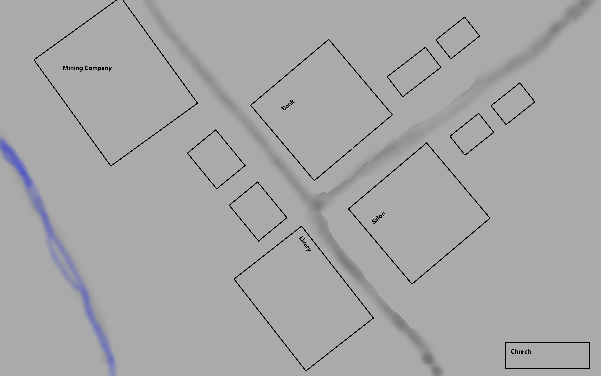

# Deadlands City of Oro

This repo contains information on the Deadlands campaign that I am running set in the City of Oro. As more information is learned by the players, I will add that information to the master branch.

## Oro City
#### Fear Level: 3

##### Theme: Gold Boomtown gone bust, silver town on the rise.

Oro City is currently a small town about four days travel west south west of Denver. In the 1860's a large placer gold discovery was made and a town quickly grew up as more prospectors flocked to the region. In a handful of months there were about 10,000 residents in the area. Placer mining is the mining of a stream bead for minerals. You can find more about it [here](https://en.wikipedia.org/wiki/Placer_mining). Unfortunately the richest deposits have been exhausted and most drifted away. In the 1870's it was determined that the heavy brown sand that made the placer mining difficult was a lead based mineral called cerussite(Cerussite is a lead based crystal. More can be found [here](https://en.wikipedia.org/wiki/Cerussite).) and that the sand also contained a lot of silver. This lead to a silver boom, but most people moved to a new town further down the river. Now the town is down to just over 300 souls as the last of the ore runs out and the fear grows.

### Faces

* [Deputy Alvan Callaghan](Faces/Deputy.Alvan.Callaghan.md)
* [Deputy Jacob Stevenson](Faces/Deputy.Jacob.Stevenson.md)
* [Edward Browne](Faces/Edward.Browne.md)
* [Elizabeth McCourt](Faces/Elizabeth.McCourt.md)
* [Horace Tabor](Faces/Horace.Tabor.md)
* [John J Hoover](Faces/John.J.Hoover.md)
* [Marshal Saul Cornell](Faces/Marshal.Saul.Cornell.md)
* [Meyer Guggenheim](Faces/Meyer.Guggenheim.md)
* [Robert Redding](Faces/Robert.Redding.md)
* [William Nye](Faces/William.Nye.md)
* [Reverend Smith](Faces/Reverend.Smith.md)
* [Attie Gordon](Faces/Attie.Gordon.md)

### Locations

* [Arcade Saloon](Locations/Arcade.Saloon.md)
* [Guggenheim Mine](Locations/Guggenheim.Mine.md)
* [Tabor's Store](Locations/Tabors.Store.md)
* [The Church](Locations/The.Church.md)

### Threats

* [John J Hoover](Threats/John.J.Hoover.md)
* [Marshal Saul Cornell](Threats/Marshal.Saul.Cornell.md)
* [Robert Redding](Threats/Robert.Redding.md)

### Map of Oro City

